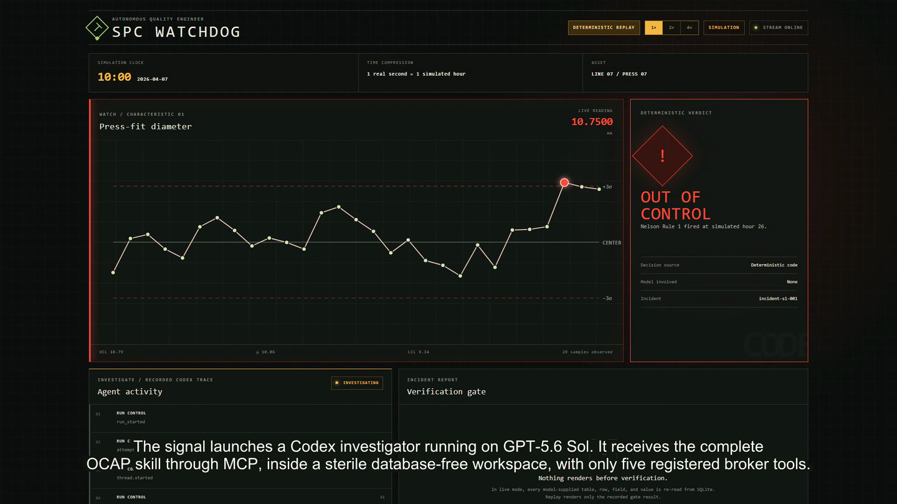
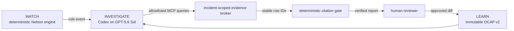
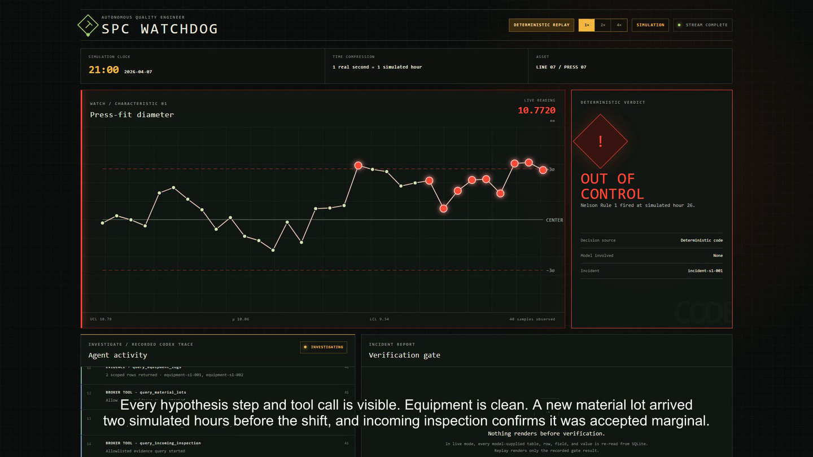
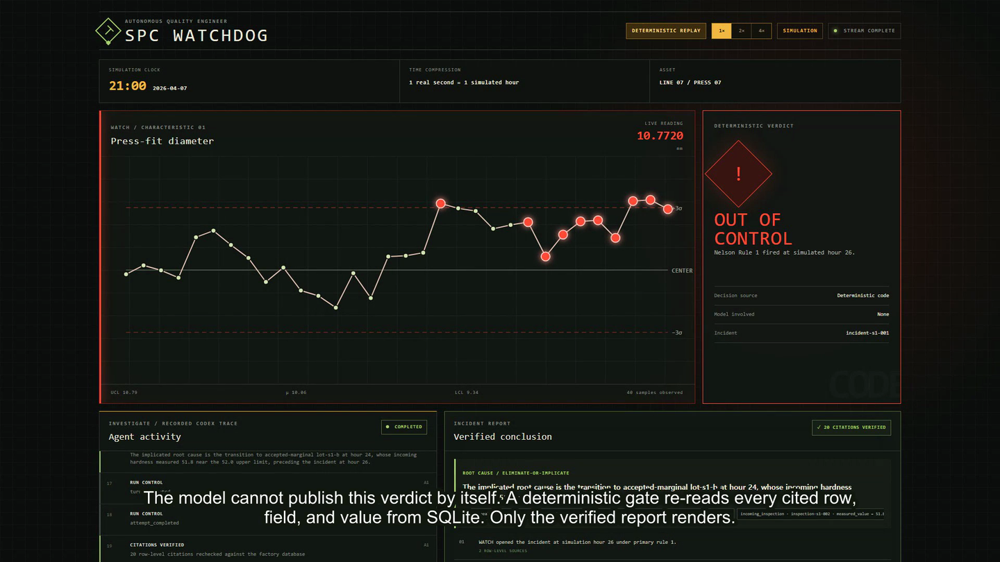
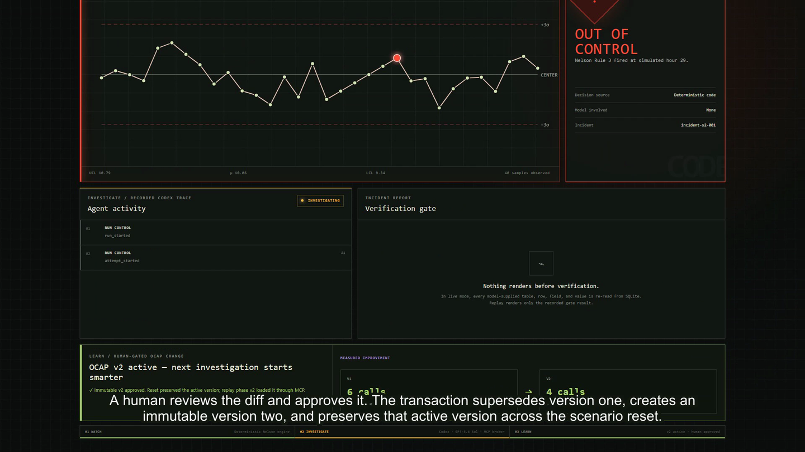

# SPC Watchdog

> **It watches, investigates, and learns.**

[](https://github.com/innoprej/spc-watchdog/actions/workflows/ci.yml)
[](LICENSE)



SPC Watchdog is an autonomous quality engineer for manufacturing lines. It watches a simulated process with deterministic statistics, delegates abnormal-signal investigation to a Codex agent running on GPT-5.6 Sol, verifies every cited factory row in code, and lets a human decide whether the agent may improve its own action-plan skill.

Built for **OpenAI Build Week — Work & Productivity** using only synthetic factory data.

## Why this matters

Statistical process control can say that a process moved. Quality engineers still have to prove why by correlating chart context, equipment events, material genealogy, inspection results, and tool life while the line is at risk.

A 2024 industry analysis puts an unproductive automotive hour at **$2.3 million — about $38,000 per minute**. That is a sector estimate, not a claimed saving from this project, but it makes investigation latency economically meaningful. [Read the source.](https://blog.siemens.com/2024/07/the-true-cost-of-an-hours-downtime-an-industry-analysis/)

The canonical live demo produced its first citation-verified report after **41.7 seconds** of investigator runtime. In the learning scenario, human-approved OCAP v2 reached the same verified tool-wear verdict in **4 registered calls instead of 6**, consulting decisive tool-life evidence before irrelevant material genealogy.

## Three layers, three owners

| Layer | Owner | What it does | What it never does |
| --- | --- | --- | --- |
| **WATCH** | Deterministic Python | Streams the simulated line, evaluates Nelson Rules 1–3, and opens an incident. | An LLM never decides whether a rule fired. |
| **INVESTIGATE** | Codex on GPT-5.6 Sol | Loads the incident's OCAP skill and performs multi-hop investigation through registered MCP tools. | The agent never receives direct database or shell access. |
| **LEARN** | Human reviewer | Reviews a grounded skill diff and may atomically activate an immutable new version. | The agent never silently edits or activates its own playbook. |



### Verdict moment 1 — deterministic detection

The UI honestly labels `1 real second = 1 simulated hour`. A seeded Rule 1 mean shift or Rule 3 trend turns the chart red before any investigator starts.

### Verdict moment 2 — transparent investigation



The activity feed is built from the `codex exec --json` event stream. It distinguishes the exact OCAP skill delivery, hypotheses, MCP calls, evidence rows, conclusion, and verification state. A skill load is shown only after the model demonstrably receives the exact body and digest.

### Verdict moment 3 — verified report



Every claim carries stable row-level citations. The host re-reads each cited table, row, field, and value from SQLite. A failed gate gets one bounded retry without leaking the correct database value; an exhausted failure remains visibly rejected instead of becoming an official verdict.

### Closing beat — human-gated learning



Scenario 2 exposes a genuine v1 playbook gap. The investigator files a proposal containing its base version, rationale, verified evidence, and patch. Human approval supersedes v1 and creates immutable v2 in one transaction. Reset preserves the approved version, and the re-run proves the exact v2 body reached the model before measuring the 6→4 improvement.

## Credential-free replay quickstart

Prerequisites: **Python 3.12** and **Node.js 22.12 or newer**.

```bash
git clone https://github.com/innoprej/spc-watchdog.git
cd spc-watchdog
python -m venv .venv
```

Activate the environment on macOS/Linux:

```bash
source .venv/bin/activate
```

Or on Windows PowerShell:

```powershell
.venv\Scripts\Activate.ps1
```

Install and start Scenario 1:

```bash
python -m pip install -e ".[dev]"
python run.py --mode replay
```

Open [http://127.0.0.1:8000](http://127.0.0.1:8000). The first run installs and builds the locked frontend dependencies. Replay requires no API key, Codex login, or factory data and keeps `DETERMINISTIC REPLAY` visible at 1×, 2×, and 4×.

Run the complete proposal → approval → smarter-v2 sequence with:

```bash
python run.py --mode replay --scenario scenario-2
```

## Live mode

Live investigation additionally requires:

- an installed and authenticated Codex CLI;
- access to the `gpt-5.6-sol` model through that login; and
- enough Codex credits for the investigation run.

```bash
python run.py --mode live
python run.py --mode live --scenario scenario-2
```

The default live path uses saved Codex authentication and credits, not an OpenAI API key. If the CLI or model is unavailable, the UI reports the failure; it never silently substitutes replay.

Each run gets a fresh database-free workspace outside this repository and an isolated credential-only `CODEX_HOME`. All discovered non-broker tool surfaces and automatic host-path context are disabled. The model can call only the incident-scoped MCP allowlist; `read-only` remains defense in depth, not the claimed database boundary. See the [runtime spike evidence](docs/codex-exec-runtime-spike.md).

## Verification

```bash
python -m pytest
cd frontend
npm ci
npm run build
cd ..
python run.py --mode replay --smoke-test
python run.py --mode replay --scenario scenario-2 --smoke-test
```

The test suite covers deterministic Nelson rules, synthetic-world contracts, exact structured output, incident-bound citation verification, safe retry feedback, broker queries, sterile runtime construction, immutable learning, sanitizer behavior, fixture order, terminal rejection, and the exact six-call/four-call replay sequences. GitHub Actions repeats the tests, frontend build, and credential-free replay boot on `ubuntu-latest` from a clean checkout.

## How I collaborated with Codex

Codex is both my implementation partner and the product's runtime investigator. The collaboration was deliberately inspectable rather than a one-shot generation:

- I started with a blindspot pass, selected explicit defaults, and encoded the non-negotiable architecture in [AGENTS.md](AGENTS.md).
- [PLAN.md](PLAN.md) carries phased acceptance gates plus a same-day record of every failed assumption, security discovery, review fix, and scope decision.
- Codex verified current `codex exec`, MCP, sandbox, working-directory, and authentication mechanics before the application depended on them.
- The first safe-sandbox subprocess approach failed. An adversarial MCP re-spike then overran its 60-minute timebox to **89 minutes** because negative probes disproved two premature isolation claims. Those failures produced the smaller sterile-workspace + allowlisted-broker design used now.
- Measured delivery was **100 minutes vs. a 150-minute Phase 1 baseline**, **65 vs. 150 minutes for Phase 2**, and **60 vs. 120 minutes for Phase 3**: 225 tracked minutes against 420 planned, about **1.9× overall acceleration**, while retaining phase-close review gates. See the [acceleration log](docs/codex-acceleration-log.md).
- The project-local `judge-panel-review` skill scored the repository against all four event criteria at every phase close. Independent implementation review found and fixed a citation-feedback leak, a fixture-sanitizer gap, a non-terminal reject path, a stale skill version string, and stale footage after a truth-label correction.
- The release candidate has **64 pytest tests**, production frontend type-check/build, two credential-free replay smokes, a full media decode, and hosted Ubuntu clean-clone evidence.

In the product, a new Codex investigator runs on GPT-5.6 Sol for each live incident. That agentic work is intentionally separated from deterministic signal detection and deterministic citation verification.

## Honest limitations

- The factory and both scenarios are synthetic, fixed demonstrations; there is no external production data.
- WATCH implements Nelson Rules 1–3, not all eight rules or configurable chart families.
- The demo supports one simulated line and one queued investigator. Multi-line scheduling and durable distributed queues are deferred.
- Approval endpoints are intended for the default loopback demo. Production identity, role-based access control, tenant isolation, and approval delegation are not implemented.
- Replay renders sanitized canonical live-run artifacts. It does not launch Codex or mutate the live factory database.
- Production observability, backups, disaster recovery, generalized OCAP authoring, rollback UI, and deployment automation remain out of scope. See [BACKLOG.md](BACKLOG.md).
- Codex reports token usage but not an exact per-run currency charge, so this project makes no precise credit-cost claim.

## License

SPC Watchdog is released under the [MIT License](LICENSE).
