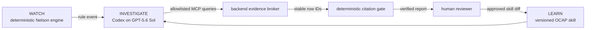

# SPC Watchdog

> It watches, investigates, and learns.

SPC Watchdog is an autonomous quality engineer for manufacturing lines. A deterministic statistical engine watches a simulated process, a Codex agent investigates abnormal signals through allowlisted evidence tools, and a human decides whether the investigation may improve its own action-plan skill.

This repository is being built for OpenAI Build Week in the Work & Productivity category. It uses only synthetic factory data and is MIT licensed.

## Current build status

Phase 2 is working end to end for Scenario 1:

- A fixed-seed SQLite factory produces AR(1) measurements and a discoverable material-lot shift.
- Typed Python code evaluates Nelson Rules 1–3. The model never decides whether a rule fired.
- FastAPI streams the simulated line over WebSocket at the honestly labeled rate `1 real second = 1 simulated hour`.
- The React control room flips from stable green to an out-of-control red verdict at the deterministic signal.
- The backend queues one shell-free GPT-5.6 Sol Codex investigator in a sterile, database-free runtime and exposes only an incident-scoped MCP broker.
- The live activity feed distinguishes the exact OCAP skill delivery, hypotheses, allowlisted tool calls, returned evidence, the root-cause decision, and deterministic verification.
- The investigator eliminates clean equipment, finds the two-hour lot transition, and confirms the accepted-marginal incoming inspection without the prompt or playbook naming that answer.
- The report renders only after every cited table, row, field, and value passes a fresh SQLite lookup. One verifier-informed retry is visible and an exhausted failure stays out of the official verdict.
- Sequence-numbered JSONL lets a reconnect resume without duplicating acknowledged activity.
- Replay mode boots without Codex credentials.

Scenario 2, the human-approved playbook change, and committed full replay fixtures remain Phase 3 work. They are not claimed as complete yet.

## Product architecture



The separation is the product:

1. **WATCH is deterministic.** Statistical judgments are code and covered by boundary tests.
2. **INVESTIGATE is agentic.** The Codex investigator receives a database-free workspace and reaches factory evidence only through registered MCP tools backed by fixed broker queries.
3. **LEARN is human-gated.** An investigator may propose a skill diff, but only approval creates a new active version.

## Quickstart

Prerequisites: Python 3.12 and Node.js 22 or newer.

```bash
python -m venv .venv
```

Activate the environment on macOS/Linux:

```bash
source .venv/bin/activate
```

Or on Windows PowerShell:

```powershell
.venv\Scripts\Activate.ps1
```

Install the Python package, then use the single cross-platform demo entry point. On its first run, it installs and builds the frontend from the lockfile.

```bash
python -m pip install -e ".[dev]"
python run.py --mode replay
```

Open [http://127.0.0.1:8000](http://127.0.0.1:8000). Replay requires no credentials and always displays `DETERMINISTIC REPLAY`.

The live WATCH + INVESTIGATE path can be started with:

```bash
python run.py --mode live
```

Live investigation requires an installed, authenticated Codex CLI with access to GPT-5.6 Sol. The UI reports a missing CLI explicitly; it never silently substitutes replay. The run uses the user's Codex login and credits rather than an API key.

## Verification

```bash
python -m pytest
cd frontend
npm ci
npm run build
cd ..
python run.py --mode replay --smoke-test
```

The CI workflow repeats these checks on `ubuntu-latest` from a clean checkout.

## Runtime boundary evidence

The runtime spike first proved that Windows safe sandboxes denied the planned `.cmd` and `.ps1` subprocess tools. The MCP re-spike then caught a second issue: read-only and beta path profiles did not reliably prevent PowerShell from reading outside the working directory. The adopted Phase 1 invocation disables every discovered non-broker tool surface and automatic host-path context, serializes the public-safe runtime contract through stdin, isolates credentials from the workspace, keeps `read-only` as defense in depth, and exposes only a fixed Streamable HTTP MCP allowlist. A GPT-5.6 Sol run returned the expected stable citation with one MCP event and no other tool event. The committed MCP entry remains disabled for ordinary contributor sessions until the backend broker is healthy.

The exact public-safe evidence and official documentation links are in [the runtime spike note](docs/codex-exec-runtime-spike.md).

## How we collaborated with Codex

Codex is both the implementation partner and a product runtime primitive.

- We began with a blindspot pass, made the unresolved architecture decisions explicit, and recorded them in [the project charter](docs/project-charter.md).
- The repository's [AGENTS.md](AGENTS.md) fixes the architecture invariants, public-safety boundary, test requirements, demo priorities, and phase-close review ritual.
- [PLAN.md](PLAN.md) is the canonical phased plan. Deviations are logged when they happen, including the failed CLI-tool spike and the passing MCP redesign.
- The project-local `judge-panel-review` skill applies the event's four judging criteria at every phase close.
- Codex checked current official documentation before invoking `codex exec`, then used its JSON event stream and a schema-constrained final response as test evidence.
- Small checkpoint commits keep the collaboration auditable rather than presenting the project as a one-shot generation.

In the finished product, each incident launches a separate Codex investigator on GPT-5.6 Sol. That runtime usage is deliberately distinct from the deterministic statistics and deterministic citation verifier.

## Honest limitations

- All factory data is synthetic and the simulation clock is compressed.
- Scenario 1 proves the complete WATCH and INVESTIGATE path; the LEARN proposal and approval flow is not implemented yet.
- The activity feed labels an OCAP skill load only when a completed MCP result contains the exact skill body and digest. The runtime copies the public-safe contract into a disposable workspace, isolates `CODEX_HOME` to authentication only, disables shell and host-context discovery, and leaves `read-only` enabled as defense in depth.
- Replay currently proves credential-free boot and deterministic WATCH playback. Committed investigation fixtures, report playback, and the 1x/2x/4x control arrive in Phase 3.
- The CLI reports token usage but not a per-run currency charge, so this project does not claim a precise Codex-credit cost.

## License

[MIT](LICENSE)
